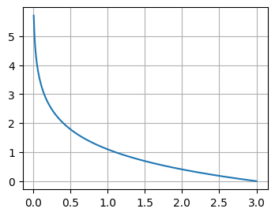

<head>
<title>Linguistic Tools</title>
<script>
MathJax = {
  tex: {
    inlineMath: [['$', '$'], ['\\(', '\\)']],
    displayMath: [['$$', '$$'], ['\\[', '\\]']]
  }
};
</script>
<script id="MathJax-script" async src="https://cdn.jsdelivr.net/npm/mathjax@3/es5/tex-mml-chtml.js"></script>
</head>

# Linguistic Tools
* Jaccard Similarity and Jaccard Distance
* Regular Expressions (RegEx)
* TF.IDF
* Hash Functions

## Jaccard Similarity
The Jaccard Similarity compares two pieces of information to see how similar they are. Each row is a set
The calculation is,

$$J(S,T) = \frac{|S\cap T|}{|S\cup T|}$$

A simple example:

$$A = \{1, 3, 5\} \qquad B = \{3, 4, 5, 6\}$$

Venn diagram (Square brackets encompass elements of A, round brackets encompass elements of B):

$$\Big[1 \Big( 3, 5 \Big] 4, 6\Big)$$

There are 5 elements total, so \|$A\cup B$\| = 5. Only 2 elements are in both, so \|$A\cup B$\| = 2.

$$J(A,B) = \frac{|A\cap B|}{|A\cup B|} = \frac{2}{5}$$

There are two similarity calculations:
* Jaccard Similarity
  * Union is all elements, not repeated - just looking at possible values

$$\lvert A\cup B \rvert = \big|\{1, 3, 4, 5, 6\}\big| = 5 \qquad J(A,B) = \frac{2}{5}$$

* Jaccard Bag Similarity
  * Union is all elements in both sets combined, as if they were two bags mixed together

$$\lvert A\cup B \rvert = \big|\{1, 3, 5, 3, 4, 5, 6\}\big| = 7 \qquad J_B(A,B) = \frac{2}{7}$$

Example #2: You create a shopping list including,
* Milk (2), eggs, bread, chips (3), salsa

But you forget the shopping list. So, you get what you can remember, plus some additional things:
* Milk (3), eggs, chips (1), salsa, yogurt, cheese, ice cream

What is the Jaccard similarity?

$$\lvert list \cap purchased \rvert = \lvert\{milk, eggs, chips, salsa\}\rvert = 4$$

$$\lvert list \cup purchased \rvert = \lvert\{milk, eggs, bread, chips, salsa, yogurt, cheese, ice cream\}\rvert = 8$$

$$J(list, purchased) = \frac{\lvert list \cap purchased \rvert}{\lvert list \cup purchased \rvert} = \frac{4}{8}=0.5$$

Notice that we did not repeat milk or chips. For the Jaccard Similarity, we only consider similar items, not repeats. For the Jaccard Bag Similarity, we do consider repeats.
* For chips, it was on the list 3 times, but we only bought 1, so it is only counted once (1)
* For milk, it was bought 3 times, but only on the list 2 times, so there are only two (2) matched pairs
  * \|list $\cap$ purchased\| = \|milk, milk, eggs, chips, salsa\| = 5
* The union is all items, even if repeated
  * \|list $\cup$ purchased\| = \|milk, milk, eggs, bread, chips, chips, chips, salsa, milk, milk, milk, eggs, chips, salsa, yogurt, cheese, ice cream\| = 17

$$J_B(list, purchased) = \frac{\lvert list \cap purchased \rvert}{\lvert list \cup purchased \rvert} = \frac{5}{17}=0.294$$

Another example:

|       |   S   |   T   |
| :---: | :---: | :---: |
| $x_0$ |   1   |   0   |
| $x_1$ |   0   |   1   |
| $x_2$ |   0   |   0   |
| $x_3$ |   1   |   1   |
| $x_4$ |   0   |   1   |
| $x_5$ |   1   |   0   |
| $x_6$ |   1   |   1   | 
| $x_7$ |   0   |   0   |
| $x_8$ |   1   |   1   |  
| $x_9$ |   0   |   1   |

To do this, we look at only positive results (entries with a "1"). The intersection would be where both $S$ and $T$ are 1:
$$\lvert S\cap T \rvert = 3$$

The union would be all entries where either $S$ or $T$ have a 1:
$$\lvert S\cup T \rvert = 8$$

We can consider, instead of a list of all datapoints, just count the number of all possibilities.

|  S  |  T  |  #  |
| --- | --- | --- |
|  0  |  0  |  2  |
|  0  |  1  |  3  |
|  1  |  0  |  2  |
|  1  |  1  |  3  |

or, looking at it with a confusion matrix,

|      |  S=1  |  S=0  |
| ---: | :---: | :---: |
|  T=1 |   3   |   3   |
|  T=0 |   2   |   2   |

$$\lvert S\cap T \rvert = 3 \qquad \lvert S \cup T \rvert = 3+3+2 = 8$$

Either way, the Jaccard Similarity is,
$$\lvert S\cap T \rvert = 3 \qquad \lvert S\cup T \rvert = 8 \qquad J(S,T) = \frac{\lvert S\cap T \rvert}{\lvert S\cup T \rvert} = \frac{3}{8}$$

The Jaccard Bag Similarity,
$$J_B(S,T) = \frac{3}{11}$$

The Jaccard Similarity can be used in a variety of ways:
* Similarity of Documents
* Plagiarism
* Mirror Pages
* Articles from the Same Source
* __Collaborative Filtering__
  * On-line Purchases
  * Movie Ratings

### Jaccard Distance
The Jaccard Similarity is a value between 0 (little to know similarity) and 1 (high similarity).

Sometimes we prefer using this value as a distance, but a distance of 0 means they are close and 1 means they are far apart. To get the Jaccard Distance, we take the complement of the Jaccard Similarity.
$$Jaccard~Distance = 1 - J(A,B)$$

## Regular Expressions (RegEx)
REGular EXpression (regex): A set of rules that helps to match patterns in a string.

Why?
* Very powerful and fast
* Find and replace text
  * Can be used for very complex patterns
* Validate strings


RegEx expressions contain a combination of normal characters (a-z, A_Z, 0-9, !@#$%^&*()) and special metacharacters. In python, these characters need to start with `r` to indicate a RegEx string:

`r"st\d\s\w{3,10}"`

* `r` in the front indicates it is a regex
* `st` looks for the patter (st) anywhere in the string
* `\` indicates a metacharacter
  * `\d` any digit (0-9)
  * `\s` any whitespace
  * `\w` any character for a word (a-z, A-Z, 0-9)
  * `{3,10}` repetitions
* Curly braces `{3,10}` is a set of number for repetitions
* Parentheses `(ab)` is a specific set of characters
* Square braces `[AB]` is an Or statement
  * `[Aa]` means either upper- or lower-case a


```python
import re

print( re.findall(r"#movies", "Love #movies! I had fun yesterday going to the #movies!")  )
print( re.split(r"!", "Nice place to eat! I'll come back! Excellent meat!")  )
print( re.sub(r"yellow", "nice", "I have a yellow car and a yellow house in a yellow neighborhood.")  )
print( re.search(r"yellow", "I have a yellow car and a yellow house in a yellow neighborhood.")  )
```

```python
# \d metacharacter
winners = "The winners are: User9, UserN, User8"

re.findall(r"User\d", winners) # A valid digit
re.findall(r"User\D", winners) # An invalid digit

# \w metacharacter
re.findall(r"User\w", winners) # A valid letter or digit

sale = "This shirt is on sale, only $5 today!"
re.findall(r"\W\d", sale) # An invalid letter or digit

# \s metacharacter
statement = "I really like ice-cream"
re.findall(r"really\slike", statement)
re.sub(r"ice\Scream", "ice cream", statement)
```

A __quantifier__ indicates how many times a pattern is repeated. Indicated by `{}`.

Other metacharacters to help with quantifiers:
* `{3}` indicates it appears 3 times
* `+` indicates it appears once or more times
* `*` indicates it appears zero or more times
* `?` indicates it appears zero times or only once
* `{3,7}` indicates it appears between 3 and 7 times
* `{3,}` indicates it appears 3 or more times

Note: r"apple+" indicates that (e) is repeated one or more times, not that (apple) is repeated.

```python
# Repetitions

password = "password1234"

re.search(r"\w\w\w\w\w\w\w\w\d\d\d\d", password)
re.search(r"\w{8}\d{4}", password)
re.search(r"\w+\d*", "password1234")
re.search(r"\w+\d*", "password")

statement = "The color of this image is amazing. However, the colour blue could be brighter."
re.findall(r"colou?r", statement)

phone_numbers = "John: 1-966-847-3131 Michelle: 54-908-42-42424"
re.findall(r"\d{1,2}-\d{3}-\d{2,3}-\d{4,}", phone_numbers)
```

```python
re.search(r"(apple){2,}", "appleappleapple")
```

re.search() vs. re.match()
* re.search() looks for patterns anywhere in the string
* re.match() looks for patterns at the beginning of the string
   * re.match() is anchored to the beginning of the string

More metacharacters:
* `^` anchors the search to the start of the string
* `$` anchors the search to the end of the string
* `.` is a wildcard
* `\` is also an escape

```python
attendance = "4506 people attended the show"
# print(re.search(r"\d{4}", attendance))
# print(re.match(r"\d{4}", attendance))

# print(re.search(r"attend", attendance))
# print(re.match(r"attend", attendance))

my_string = "the 80s music was much better than the 90s"
re.findall(r"the\s\d+s", my_string)
re.findall(r"^the\s\d+s", my_string)
re.findall(r"the\s\d+s$", my_string)
re.findall(r"the\s.0s", my_string)

sale
re.findall(r"\$5", sale)
```

```python
# OR operator
my_string = "Elephants are the world's largest land animal! I would love to see an elephant one day."
re.findall(r"Elephant|elephant", my_string)

re.findall(r"[Ee]lephant", my_string)

lotr = "The oliphant in Lord of the Rings is similar to the elephant in real life"
re.findall(r"[eo]l[ei]phant", lotr)

my_string = "Yesterday I spent my afternoon with my friends: MaryJohn2 Clary3 JohnPhilip"
re.findall(r"[a-zA-Z]+\d+", my_string)
```

```python
phrase = "Students passing this class: Anthony, Ethan, Augustin"
re.search(r":.*Michael.*",phrase)
```

## TF.IDF
What makes a word in a document important? 
* Words appearing most frequently?
  * The most frequent words will always be common non-useful terms such as "the" or "and" (aka "stop words")
  * ---Draw 1D line for frequency---
    * Low: "Notwithstanding", "Albeit", "Conclusion"
    * High: "the", "and"
* Rare words
  * A lot of rare words are only used to help in sentence flow, such as "notwithstanding", "albeit", or "conclusion"
  * ---Draw 1D line for rarity---
    * Rare: "Notwithstanding", "Albeit"
    * Common: "the", "and", "conclusion"

*The difference between rare words that tell us something and those that do not has to do with the concentration (frequency) of the useful words in just a few documents.*
  * ---Draw 2D grid: x-axis rare to common, y-axis Low f to High f---
  * High f, common: "the", "and"
  * Low f, common: "conclusion"
  * Low f, rare: "notwithstanding", "albeit"
  * The important words are those that have high f and are rare (only occur with high frequency in just a few documents)

We'll calculate using the $TF.IDF$ (Term Frequency times Inverse Document Frequency)
* Term frequency ($TF_{ij}$): number of occurrences of word $i$ normalized in document $j$
$$TF_{ij} = \frac{f_{ij}}{max_k f_{kj}}$$

| __*Frequency*__ | Doc 0 | Doc 1 | Doc 2 |
| --------------: | :---: | :---: | :---: |
|          Word 0 |   7   |   8   |   4   |
|          Word 1 |   2   |   4   |   6   |
|          Word 2 |   5   |   9   |   0   |

$$max_k f_{k0} = 7 \qquad max_k f_{k1} = 9 \qquad max_k f_{k2} = 6$$

| __*TF*__ | Doc 0 | Doc 1 | Doc 2 |
| -------: | :---: | :---: | :---: |
|   Word 0 |   1   |  8/9  |  2/3  |
|   Word 1 |  2/7  |  4/9  |   1   |
|   Word 2 |  5/7  |   1   |   0   |

* Inverse Document Frequency ($IDF_i$): Inverse ratio of documents containing word $i$ on a logarithmic scale
  * If $n_i$ documents out of $N$ documents contain word $i$, then the ratio is $\frac{n_i}{N}$
  * The inverse ratio is $\frac{N}{n_i}$
  * Put onto a logarithmic scale



On an inverse logarithmic scale, words that appear in fewer documents ($n_i$) will give a large $IDF$, which should be the case for words that are unique to specific topics. But if the word appears in more documents, then the $IDF$ will approach 0.

$$IDF_i = \log_2\left(\frac{N}{n_i}\right)$$

| __*TF*__ | Doc 0 | Doc 1 | Doc 2 |
| -------: | :---: | :---: | :---: |
|   Word 0 |   1   |  8/9  |  2/3  |
|   Word 1 |  2/7  |  4/9  |   1   |
|   Word 2 |  5/7  |   1   |   0   |

$$IDF_0 = \log_2\left(\frac{3}{3}\right) = 0$$
$$IDF_1 = \log_2\left(\frac{3}{3}\right) = 0$$
$$IDF_2 = \log_2\left(\frac{3}{2}\right) = 0.58$$

| __*TF.IDF*__ | Doc 0              | Doc 1           | Doc 2        |
| -----------: | :----------------: | :-------------: | :----------: |
|       Word 0 | $$1*0=0$$          | $$8/9*0=0$$     | $$2/3*0=0$$  |
|       Word 1 | $$2/7*0=0$$        | $$4/9*0=0$$     | $$1*0=0$$    |
|       Word 2 | $$5/7*0.58=0.418$$ | $$1*0.58=0.58$$ | $$0*0.58=0$$ |

Word 2 is the most significant word in all documents, and is most significant in Doc 1.

## Hash Functions
When we need to search for a particular value, we could simply go through all the values until we find the one we want. This is called a __linear search__. For small datasets, this works just fine. But for large datasets, this is inefficient.

A __hash function__ takes some key value related to the data and produces a __bucket number__, or a __hash-key__. That is, we take something intuitive about the data (ID, name, timestamp,...) and do some calculation on it to determine what bucket, or place in our array, the data should be stored. Then when we want to recall that data, we do the same calculation, and we know exactly where that data is stored.

The following three examples demonstrate how one common hash function works, and presents a potential issue.

*Example 1*:
> You have data for 10 patients that you want to store in the database.
> * Their IDs are:
>   * [100, 186, 152, 199, 103, 127, 175, 131, 114, 148]
> * To determine the bucket to store the data in (the hash-key), take the modulus of each ID with the number of elements (10)
> $$f_h(x) = x \% n$$
>   * [0, 6, 2, 9, 3, 7, 5, 1, 4, 8]
> * Store the data:
>   * `ID = [[0], [1], [2], [3], [4], [5], [6], [7], [8], [9]]`
>   * `ID = [100, ___, ___, ___, ___, ___, ___, ___, ___, ___]`
>   * `ID = [100, ___, ___, ___, ___, ___, 186, ___, ___, ___]`
>   * `ID = [100, ___, 152, ___, ___, ___, 186, ___, ___, ___]`
>   * `ID = [100, ___, 152, ___, ___, ___, 186, ___, ___, 199]`
>   * `ID = [100, ___, 152, 103, ___, ___, 186, ___, ___, 199]`
>   * `ID = [100, ___, 152, 103, ___, ___, 186, 127, ___, 199]`
>   * `ID = [100, ___, 152, 103, ___, 175, 186, 127, ___, 199]`
>   * `ID = [100, 131, 152, 103, ___, 175, 186, 127, ___, 199]`
>   * `ID = [100, 131, 152, 103, 114, 175, 186, 127, ___, 199]`
>   * `ID = [100, 131, 152, 103, 114, 175, 186, 127, 148, 199]`
> * If you want patient 186, take the modulus $f_h(186) = 186 \% 10 = 6$. The data is in bucket 6 for all lists.
>   * `ID[6] = 186`, `name[6]`, `weight[6]`, ...

### When two entries get the same index
Sometimes, our hash function will cause two or more entries to receive the same hash-key. For example, $f_h(114) = 114\%10 = 4$ and $f_h(124) = 124\%10 = 4$. 

We start by going to the bucket indicated by our hash-key, just as before. If that bucket is already filled, move to the next index. Sometimes, you may have to advance multiple indices before finding an empty bucket.

When we recall the information, then the index from our hash-key becomes a starting point for a linear search. If the correct entry is in the bucket from our calculation, then no search is required. If the correct entry is not in the bucket from our calculation, then we look at the next bucket, then the next, and so on until we find the right information.

*Example 2*:

This example is the same as example 1, but notice that some of the calculations repeat bucket numbers:
> You have data for 10 patients that you want to store in the database.
> * Their IDs are:
>   * [245, 287, 261, 295, 233, 209, 276, 284, 260, 221]
> * To determine the bucket to store the data in, take the modulus of each ID with the number of elements (10)
>   * [5, 7, 1, 5, 6, 3, 6, 1, 4, 8]
> * Store the data:
>   * `ID = [___, ___, ___, ___, ___, 245, ___, ___, ___, ___]`
>   * `ID = [___, ___, ___, ___, ___, 245, ___, 287, ___, ___]`
>   * `ID = [___, 261, ___, ___, ___, 245, ___, 287, ___, ___]`
> * The next is 295 going into bucket 5. But bucket 5 is already filled. So, fill the next bucket.
>   * `ID = [___, 261, ___, ___, ___, 245, 295, 287, ___, ___]`
>   * `ID = [___, 261, ___, 233, ___, 245, 295, 287, ___, ___]`
>   * `ID = [___, 261, ___, 233, ___, 245, 295, 287, ___, 209]`
> * The next is 276 going into bucket 6. But bucket 6 is already filled. So, go to the next bucket, but that is also filled. Just keep going and fill the next available bucket.
>   * `ID = [___, 261, ___, 233, ___, 245, 295, 287, 276, 209]`
>   * `ID = [___, 261, ___, 233, 284, 245, 295, 287, 276, 209]`
>   * `ID = [260, 261, ___, 233, 284, 245, 295, 287, 276, 209]`
> * The next is 221 going into bucket 1. But bucket 1 is already filled. So, fill the next bucket.
>   * `ID = [260, 261, 221, 233, 284, 245, 295, 287, 276, 209]`
> * If you want patient 233, take the modulus $233 mod 10 = 3$. The data is in bucket 3 for all lists.
>   * `ID[3] = 233`, `name[3]`, `weight[3]`, ...
> * If you want patient 276, take the modulus $276 mod 10 = 6$. But this time, the data isn't in bucket 6. Go to bucket 6 and start a linear search from there.
>   * `ID[6] = 295`
>   * `ID[7] = 287`
>   * `ID[8] = 276` is a match!
>   * The data is in bucket 8 for all lists.
>   * `ID[8] = 276`, `name[8]`, `weight[8]`, ...

### Tips on Hash Functions
Because of the possibility of overlapping data from our hash function, there are a few tips that help to reduce this possibility.
1. Make the array larger than it needs to be
    * If the array is larger, than that gives more possible results, reducing the chance for repeated hash-keys
    * If there are repeated hash-keys from $f_h(x)$, then there is more likely space close to the result, reducing the length of the linear search if it's needed
2. Make the array size ($n$) a prime number
    * If there is a prime number of bins, then the chance of repeated results decreases
    * Choosing ($n$) such that it has common factors with most hash-keys, then the possible hash-keys result in nonrandom distribution into buckets - so a prime number of buckets is preferred

    > Suppose your population is only contained of even numbers. If $n=10$, then the only buckets that can be filled normally are $0, 2, 4, 6,$ and $8$. However, if we choose $n=11$, then the even integers create an equal 1/11 probability for each bucket.

    * Be sure to consider the case when the prime number $n$ is a factor in most values of your population. If this is the case, just choose a different prime number.
  
  ### Hash Functions with Text
  When we are dealing with text, we have to find a way to convert text into numberical values. A simple example would be to convert each letter in the text into its appropriate ASCII code.

*Example 3*:

In this example, we use names instead of IDs.
> You have data for 5 patients that you want to store in the database.
> * Their names are:
>   * [Jon, Sue, Sam, Dan, Ted]
> * Create a numberical value by adding the ASCII codes for each character in the name. Then take the modulus of that result with the number of patients (5).
>   * 'Jon' = 74 + 111 + 110 = 295 --> 295 mod 5 = 0
>   * 'Sue' = 83 + 117 + 101 = 301 --> 301 mod 5 = 1
>   * 'Sam' = 83 +  97 + 109 = 289 --> 289 mod 5 = 4
>   * 'Dan' = 68 +  97 + 110 = 275 --> 275 mod 5 = 0
>   * 'Ted' = 84 + 101 + 100 = 285 --> 285 mod 5 = 0
> * Store the data:
>   * `ID = [Jon, ___, ___, ___, ___]`
>   * `ID = [Jon, Sue, ___, ___, ___]`
>   * `ID = [Jon, Sue, ___, ___, Sam]`
>   * `ID = [Jon, Sue, Dan, ___, Sam]`
>   * `ID = [Jon, Sue, Dan, Ted, Sam]`

Notice how in this last example, finding the record for Ted is almost as many tests as just doing a linear search. Certain datapoints could have that issue. But for the most part, this is a very straightforward hash function that simplifies the search process. On the whole, the number of calculations needed to find a name has dropped drastically.

